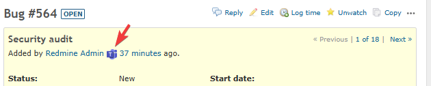

# redmine_teams_button

> [!Tip]
> With [redmine_studio_plugin](https://github.com/RedminePower/redmine_studio_plugin), you can manage this feature along with other useful features in one place.
>
> Also, combined with the [Redmine Studio](https://www.redmine-power.com/) app, you can enjoy an even better Redmine experience.

## Overview

A plugin that adds a "Teams" button next to usernames, allowing you to start a chat with one click.
Clicking the button opens a Teams chat pre-filled with issue information (title, URL, issue ID).



For details, see [here](https://github.com/RedminePower/redmine_studio_plugin/blob/master/docs/teams_button-en.md).

## Supported Versions

- Redmine 5.x (tested with 5.1.11)
- Redmine 6.x (tested with 6.1.1)

## Installation

The Redmine installation path varies depending on your environment.
The following instructions use `/var/lib/redmine`.
Please adjust according to your environment.

| Environment | Redmine Path |
|-------------|--------------|
| apt (Debian/Ubuntu) | `/var/lib/redmine` |
| Docker (Official Image) | `/usr/src/redmine` |
| Bitnami | `/opt/bitnami/redmine` |

Run the following commands and restart Redmine.

```bash
cd /var/lib/redmine/plugins
git clone https://github.com/RedminePower/redmine_teams_button.git
```

After restarting, enable "Teams button" in the project's "Settings" → "Modules".

## Uninstallation

Remove the plugin folder and restart Redmine.

```bash
cd /var/lib/redmine/plugins
rm -rf redmine_teams_button
```
